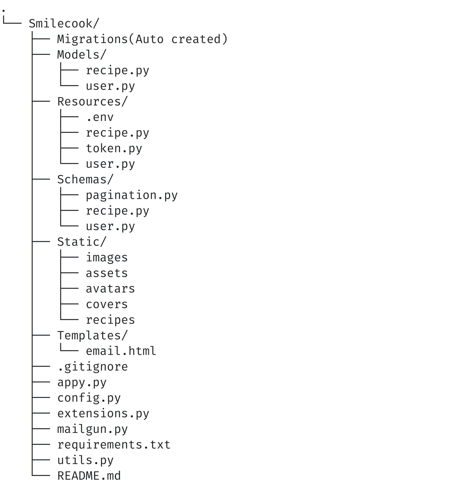

## Smilecook recipe platform

I have created an API for an application named _**Smilecook**_ to share recipes with everyone with your created account.

To test the backend of the application you can use PostMan.
For the database I'm running PostgreSql.

The overall strucuture of the project:

